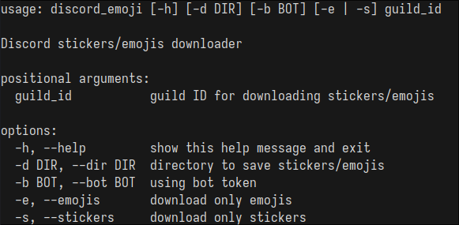

# discord_emoji

Discord emoji/stickers downloader. It allows you to download emojis/stickers from the guilds you belong to.

<p align=center>
  
</p>

## Prerequisites
* **Python 3.9** or highter

## Dependencies
* [aiohttp](https://pypi.org/project/aiohttp/)
* [pillow](https://pypi.org/project/pillow/)

## Installing

Clone the repository

```bash
git clone https://github.com/wakozim/discord_emoji.git
```

Install dependencies

```bash
python3 -m pip install -r requirements.txt
```

Create a new file `environment`.
```bash
cp .env.example .env
```

Fill in appropriate variables in new "environment" file.

## Using

To use discord_emoji just run:
```bash
python3 -m discord_emoji -h
python3 -m discord_emoji guild_id
```
